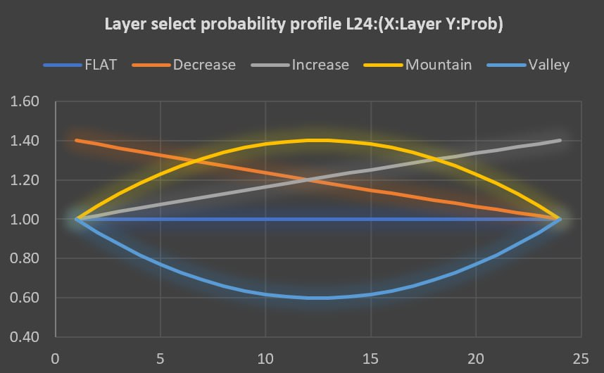

# RWKV-LM-LISA

# WARNING: Eternal Debugging, pre-release.
This repo is forked from RWKV-LM

Test implement of Layerwise Importance Sampled AdamW
## 2024.04.10 Update
1. Implemented layer selection probability profiling
   - You can now change the selection probability for each layer in CSV format. Perhaps under certain conditions it should be able to contribute to loss optimization
2. Implemented permanent freezing function in layers
   - You can now permanently freeze certain elements during training. This makes it possible to consider modifying the Loss and creating a merge model.

## 2024.04.09 Update
1. Implemented random element freezing function(LISA+)
   - In addition to the existing LISA training method, we randomly freeze some of the elements in the specified layer to improve VRAM efficiency and training speed.
   - Now can train RWKV 7b on 24GB GPU with 4k ctx with ds2 offload
   - tested RWKV v6 1.6b 4kctx ds1 4bsz @ Single 4090 8.5Kt/s 

## Usages
1. Prepare SFT Dataset:
   - Compatible with Original RWKV-LM dataset format
2. Run `train.py`:
   - Currently RWKV-5 and 6 are supported;
   - if use LISA+ set --lisa_plus_enabled 1
   - --lisa_plus_att_train_params　List of att elements to be frozen
   - --lisa_plus_att_active_weight　Number of att elements trained simultaneously
   - --lisa_plus_ffn_train_params　List of ffn elements to be frozen
   - --lisa_plus_ffn_active_weight　Number of ffn elements trained simultaneously
   - if more save VRAM, reduce --lisa_plus_att_active_weight or --lisa_plus_ffn_active_weight
   - --lisa_plus_att_permanent_freeze_params List of att elements to be frozen permanently
   - --lisa_plus_ffn_permanent_freeze_params List of ffn elements to be frozen permanently
   - if use layer selection probability profiling set --lisa_plus_custom_layer_probabilities 1
   - --lisa_plus_custom_layer_probabilities_profile Enter the file name of the profile in CSV format


## This repo works
   - 1. Freeze all layers
   - 2. Choose active layers(lisa_active_layer) randomly every lisa_interval_steps
   - 3. In chosen layer, freeze elements randomly.(20240409Update)   
   - 4. Foward and backward

I wish performance close to full parameter learning
 
My training command is provided as follows:
```
python train.py --load_model "base_model/RWKV-x060-World-1B6-v2.1-20240328-ctx4096.pth"\
 --wandb "RWKV-LM-LISA+ v6 1.6b" --proj_dir "1.6b-output"\
 --data_file "dataset/dataset"\
 --data_type "binidx" --vocab_size 65536 --ctx_len 4096 \
 --epoch_steps 2000 --epoch_count 1000 --epoch_begin 0 --epoch_save 1 \
 --micro_bsz 4 --n_layer 24 --n_embd 2048\
 --lr_init 1e-6 --lr_final 1e-7 \
 --warmup_steps 100 --beta1 0.9 --beta2 0.999 --adam_eps 1e-8 \
 --accelerator gpu --devices 2 --precision bf16 \
 --grad_cp 1 --my_testing "x060" \
 --strategy deepspeed_stage_1 \
 --lisa 1 \
 --lisa_active_layer 1 \
 --lisa_interval_steps 5 \
 --lisa_debug 1 \
 --lisa_rand_seed 0 \
 --lisa_plus_enabled 1 \
 --lisa_plus_att_train_params "att.receptance.weight,att.key.weight,att.value.weight,att.gate.weight,att.output.weight" \
 --lisa_plus_att_active_weight 3 \
 --lisa_plus_ffn_train_params "ffn.receptance.weight,ffn.key.weight,ffn.value.weight" \
 --lisa_plus_ffn_active_weight 2 \
 --lisa_plus_att_permanent_freeze_params '' \
 --lisa_plus_ffn_permanent_freeze_params '' \
 --lisa_plus_custom_layer_probabilities 1\
 --lisa_plus_custom_layer_probabilities_profile 'layerprofile/24_Flat.csv' \
 --gpu_arch rocm
```

## Todo
   - 1. (Done)Make a layer selection probability profile
   - 2. Implement Direct Preference Optimization with LISA


# And Thanks to:
RWKV-LM @BlinkDL
LMFlow @OptimalScale


# License
same with RWKV-LM

Apache 2.0


@ 2024 OpenMOSE
